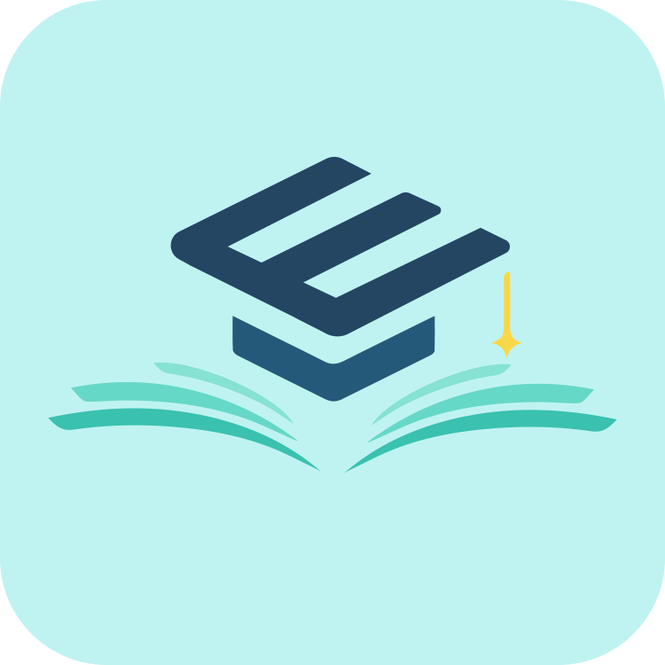

DỰ ÁN CUỐI KỲ: PHẦN MỀM QUẢN LÝ & GIẢNG DẠY HỖ TRỢ GIÁO VIÊN

Phần mềm được phát triển như một Dự án Cuối kỳ môn **Công nghệ Phần mềm**.

**Giảng viên Hướng dẫn:** ThS. Võ Hoàng Quân

## TỔNG QUAN DỰ ÁN

Đây là một ứng dụng toàn diện được thiết kế đặc biệt nhằm **giảm thiểu thời gian nhập liệu thủ công**, **tăng tính trực quan** trong công tác quản lý lớp học, và tạo môi trường học tập **sinh động** thông qua các hoạt động tương tác.

### MỤC TIÊU CHÍNH CỦA PHẦN MỀM

Mục tiêu cốt lõi là hỗ trợ Giáo viên tập trung nhiều hơn vào công tác giảng dạy bằng cách **tự động hóa** các quy trình quản lý hành chính:

* **Quản lý Học sinh & Lớp học:** Hỗ trợ nhập liệu, thực hiện điểm danh nhanh chóng và ghi nhận kết quả học tập.
* **Quản lý Quỹ Lớp:** Theo dõi thu chi, đảm bảo tình trạng đóng tiền rõ ràng và minh bạch.
* **Hoạt động Giảng dạy:** Cung cấp công cụ để triển khai các Mini-Game tương tác ngay trên lớp, tạo hứng thú cho học sinh.

## ĐỐI TƯỢNG SỬ DỤNG

Phần mềm được thiết kế để phục vụ các nhóm người dùng chính sau:

| Đối tượng | Vai trò và Chức năng Chính |
| :--- | :--- |
| **Giáo viên (Người dùng cuối)** | Người trực tiếp sử dụng phần mềm để quản lý lớp học và tổ chức các hoạt động giảng dạy. |
| **Giáo viên Chủ nhiệm (GVCN)** | Thực hiện các chức năng quản lý tài chính (Quỹ lớp) và ghi nhận, theo dõi hành vi học sinh. |
| **Admin/Hỗ trợ Kỹ thuật** | Chịu trách nhiệm quản lý tài khoản, theo dõi tổng thể hệ thống và hỗ trợ người dùng khi cần. |

## THÀNH VIÊN THỰC HIỆN

| Mã số sinh viên | Họ và Tên |
| :--- | :--- |
| 52300118 | Phạm Văn Minh Khang |
| 52300112 | Dương Gia Huy |
| 52300116 | Lâm Vĩ Khang |
| 52300007 | Bùi Gia Bảo |
| 52200310 | Trần Nhật Trường |

  

